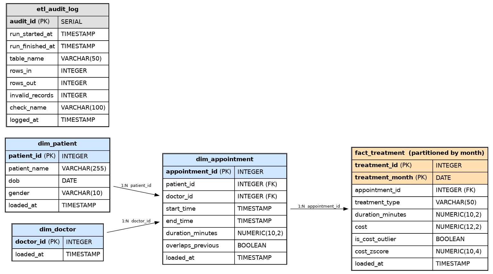

# Healthcare ETL Capstone

A healthcare data pipeline that extracts messy source data, validates and cleans it,
computes derived metrics, and loads it into a PostgreSQL star schema for analytics —
built with Python (Pandas/NumPy), PostgreSQL, and SQLAlchemy.



## Architecture

```
CSV sources (patients, appointments, treatments)
        │
        ▼
   Extract  ──►  validation.py   (nulls, duplicates, orphans, invalid literals)
        │
        ▼
  Validate  ──►  docs/data_quality_report.md  (auto-generated)
        │
        ▼
 Transform  ──►  transform.py    (cleaning, orphan removal, metrics, outliers)
        │
        ▼
    Enrich  ──►  cost aggregation, frequent visitors, monthly summaries
        │
        ▼
      Load  ──►  load.py         (upsert into Postgres star schema)
        │
        ▼
 PostgreSQL: dim_patient, dim_doctor, dim_appointment, fact_treatment (partitioned)
        │
        ▼
 Analytics  ──►  sql/analytics_queries.sql   (10 required queries)
        │
        ▼
     Audit  ──►  sql/audit_checks.sql + etl_audit_log table
```

Orchestrated end to end by the `HealthcareETL` class in `src/etl.py`
(`extract → validate → transform → enrich → load → run`).

## Project Structure

```
healthcare-etl-capstone/
├── data/
│   ├── raw/              # generated CSVs (gitignored)
│   └── processed/
├── src/
│   ├── generate_data.py  # synthetic data generator (intentionally dirty)
│   ├── models.py         # Patient, Appointment dataclasses
│   ├── etl.py             # HealthcareETL orchestration class
│   ├── validation.py      # extract + validation checks + quality report
│   ├── transform.py       # cleaning, metrics, outlier/overlap detection
│   ├── load.py             # upsert logic into Postgres
│   └── database_connection.py  # SQLAlchemy engine from .env credentials
├── sql/
│   ├── ddl.sql                  # star schema (fact_treatment is partitioned by month)
│   ├── analytics_queries.sql    # 10 required analytics queries
│   └── audit_checks.sql         # independent SQL-side data quality checks
├── tests/
│   └── test_etl.py       # 11 unit tests (pytest)
├── docs/
│   ├── ERD.png
│   └── data_quality_report.md   # regenerated on every ETL run
├── requirements.txt
└── README.md
```

## Setup

```bash
# 1. Clone and enter the project
git clone <repo-url>
cd healthcare-etl-capstone

# 2. Create and activate a virtual environment
python -m venv .venv
source .venv/bin/activate   # or .venv\Scripts\activate on Windows

# 3. Install dependencies
pip install -r requirements.txt

# 4. Set up Postgres credentials
# Create a .env file at the project root (never committed — see .gitignore):
#   DB_HOST=localhost
#   DB_PORT=5432
#   DB_NAME=healthcare_etl
#   DB_USER=postgres
#   DB_PASSWORD=<your password>

# 5. Create the database and schema
createdb healthcare_etl
psql -U postgres -d healthcare_etl -f sql/ddl.sql

# 6. Generate source data
python src/generate_data.py

# 7. Run the full pipeline
python src/etl.py

# 8. Run tests
pytest tests/test_etl.py -v
```

## What the pipeline does

**Extract** — loads the three raw CSVs, each containing intentionally injected data
quality issues (duplicate IDs, null values, invalid date/timestamp strings, and
orphaned foreign keys) to simulate a realistic messy source system.

**Validate** — runs a battery of checks (nulls, duplicates, orphans, invalid literals)
and writes a timestamped Markdown report to `docs/data_quality_report.md` on every run.

**Transform** — cleans all three tables, drops orphaned rows (in dependency order,
so newly-orphaned treatments created by dropping bad appointments are also caught),
computes visit duration, per-patient cost aggregation, frequent-visitor flags,
z-score-based cost outlier detection, per-doctor overlapping-appointment detection,
and monthly visit summaries. `doctor_id` and `treatment_type` are cast to pandas
`category` dtype for lower memory use and faster groupby operations. All logic is
vectorized (no row-by-row Python loops).

**Load** — upserts cleaned data into a PostgreSQL star schema using
`INSERT ... ON CONFLICT DO UPDATE`, making re-runs idempotent. Loads in dependency
order: `dim_patient`/`dim_doctor` → `dim_appointment` → `fact_treatment`.

**Audit** — writes per-check metrics (rows in/out, invalid record counts) to
`etl_audit_log` on every run, and `sql/audit_checks.sql` independently re-verifies
referential integrity, duplicate-freedom, and value bounds directly against the
loaded warehouse — a second, SQL-side line of defense separate from the Python
validation logic.

## Schema design notes

- **`dim_doctor`** exists purely for proper star-schema normalization — the source
  data has no doctor attributes beyond an ID, so this dimension is populated from
  distinct `doctor_id`s observed in appointments at load time.
- **`fact_treatment` is partitioned by month** (`treatment_month`, a denormalized
  copy of the parent appointment's `start_time`, truncated to month) via
  `PARTITION BY RANGE`. This requires a composite primary key
  `(treatment_id, treatment_month)` instead of a single-column PK. At this
  project's scale (~6K rows) the performance benefit is negligible — partitioning
  pays off at millions of rows — but it's implemented for real (not just described)
  as a demonstration of the pattern and its schema tradeoffs.
- **Foreign keys are enforced at the database level**, even though the data loaded
  is already orphan-free by the time it reaches Postgres. This is intentional
  defense in depth: the constraints should never actually reject a row given a
  correctly functioning pipeline, but they'd immediately surface a bug if one
  were introduced upstream.

## Known assumptions and limitations

- **Cohort analysis proxy**: the source data has no patient "signup" date, so
  each patient's cohort is defined as the month of their *first appointment* —
  the standard substitute when no registration date exists.
- **Overlap detection has two independent implementations that intentionally
  disagree**: the Python transform (`detect_overlapping_appointments`) only
  compares each appointment to the one immediately before it per doctor
  (adjacent-pair check), while the SQL version (`analytics_queries.sql`, query 6)
  finds every pairwise overlapping combination. When 3+ appointments overlap
  for the same doctor, these methods produce different counts — this is a
  known, explainable divergence between "adjacent overlap" and "any overlap"
  definitions, not a bug.
- **Cost outlier detection also has two valid definitions in this project**:
  z-score (`is_cost_outlier` in `fact_treatment`, threshold 3.0) versus top-1%-
  by-value (`analytics_queries.sql`, query 9). Because the source data's cost
  field is generated from a uniform distribution with no injected extreme
  values, the z-score method correctly finds **zero** statistical outliers,
  while the percentile method always finds *something* by construction. Both
  are "correct" — they answer different questions.

## Testing

11 unit tests in `tests/test_etl.py` cover duration calculation, cost aggregation
(including orphan exclusion), duplicate detection, orphan detection (including null
handling), null detection, cost outlier flagging, and frequent-visitor flagging.

```bash
pytest tests/test_etl.py -v
```
